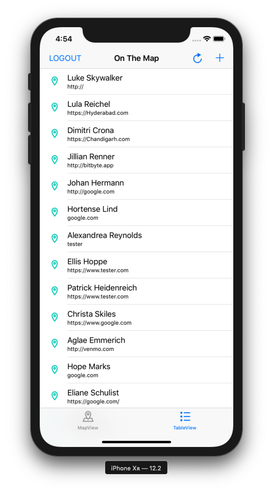

# Udacity iOS Developer Nanodegree - OnTheMap App
This repository contains the OnTheMap app from Udacity's Network Requests and GCD course. This app utilizes user authentication over a 
network connection. The app also connects to RESTful networked APIs to read and write data. The Udacity API to authenticate the user 
and retrieve the user's basic information, such as their name. The Parse API is used to POST and PUT the user's location, as well as 
GET other users' locations.

## Overview
OnTheMap utilizes user authentication to allow users to sign into the app with their Udacity account. If the user does not have an account, the user can instead press "Sign Up" to open a link in Safari and be redirected to Udacity's registration page.

Upon signing in, the user is presented with a map of the United States with pins on locations posted by students. Pressing on a pin opens up a description with the student's name and the media URL the student shared. Pressing on the "i" icon forwards that URL to Safari to be opened. Alternatively, the user can view a list of the latest 100 posts in a table view. Pressing on a row will open the URL in Safari.

  

Tapping on the add icon in the upper right corner allows users to add their own pin to the map by providing a string that can be geo-coded to a location and a URL. After the user enters valid information in both fields, the user will be presented with a confirmation screen, which is a map showing a pin on the specified location.

 

After the user confirms the location, the pin will be posted and the map and table will be updated with the newly posted pin. The user's name is changed for security purposes, but the user can identify themselves by checking the location and the media URL associated with their pin.

 
